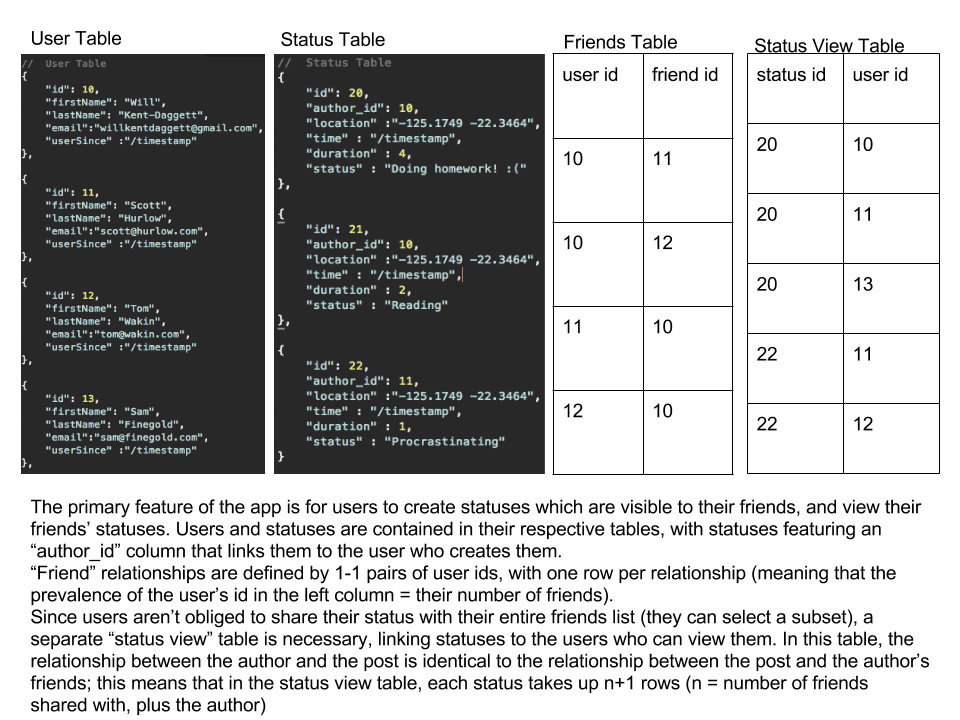

# sup

##General App Contents / Features:

-	Info associated with 1 SUP:
	-	Location
	- Name
	- Status?

- Backend Routes:
	- Setup: Send contacts to server
	- Get active users
	- Get single users data
	- Set new location / SUP object

### main views:

-	main window
	-	view map
	-	settings drawer to the right
	-	friendlist drawer to the left
-	first time login
	-	banner
	-	sign in w/phone #
	-	import friends from fb 1-time option
-	view specific user
	-	have more information than just picture, name, recent checkin?
	
### database schema:

	

### to-do for midterm presentation:

* ~~make visual represetnation of the schema (Will)~~
* ~~clean up API code/documentation (change fake GET requests to POSTs, etc) (Will and Scott)~~ - before spring break
* wireframes (Tom) - by 3/25
* display server response to GET and POST requests within iOS app (Sam) - by 3/25
	* get client to post new users
	* get client to post new status
	* show user added to table
* display SUP status locations on client (integrating with gmaps) (Scott)
* Merge client repo into existing sup project (Sam)
* make a slideshow to wrap all of our progress together (everybody - 3/26)
	* potential structure: wireframes, database schema, demo

